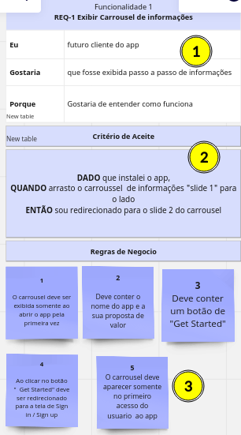

# Projeto Travell App 

Este projeto foi criado com proposito de práticar o **Levantamento de Requisito de um projeto**. Onde foi levado em consideração analisar um projeto do tipo Figma retirado do site UpsLabs onde vários designers tem a possibilidade de subir os seus projetos. 

Com isso irei demonstrar  a  analise do projeto **Travell App** onde atraves do protótipo irei analisar os requisitos desejaveis para o projeto.

## Protótipo
---
- Prototipo do Upslab [TravellApp](https://www.uplabs.com/posts/travel-app-design-71c230d6-e723-4c66-b62c-ab57d8c23f47)

## Analíse do Projeto
---
A iamagem abaixo irá indicar como feita a análise deste projeto, onde foi utilizado:  **MIRO** para fazer a analise de forma visual.

1. Indicação de qual requirimento iremos analisar,  indicando seuu numero e nome

2. Descrição em alto nível da funcionalidade indicando o usuário que irá uilizar a funcionalidade desejada e o porque da existência desta funcionalidade.
   
3. Listagem das regras de négocio a serem implementadas.

## Referência da Análise
---

- REQ-1 Exibir Carrousel Informações
- REQ-2 Botão de Sign in(login)
- REQ-3 Realizar Login
- REQ-4 Esqueceu a Senha
- REQ-5 Botão de Cadastro (Sign up)
- REQ-6 Realizar Cadastro
- REQ-7 Termos de Privacidade
- REQ-8 Conta já Cadastrada
- REQ-9 Realizar login com facebook
- REQ-10 Realizar login conta Google
- REQ-11 Criar padrão de Header
- REQ-12 Implementar Pesquisa
- REQ-13 Implementar Filtro
- REQ-14 Encontre sua viagem
- REQ-15 Mostrar Viagens Populares 
- REQ-16 Implementar Icone de Favorito
- REQ-17 Criar Perfil de viagem
- REQ-18 Exibição do ícone Home em destaque
- REQ-19 Exibição de  Rota viagem
- REQ-20 Implementar  Reserva de hotel
- REQ-21 Modalidade de Pagamento 

