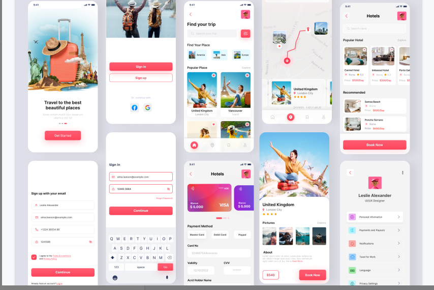

# Portfólio
Este projeto tem como finalidade mostrar meu trabalho de analise de requisitos, regras de negocio e critério de aceite utilizando Gherkin

Neste repositorio você irá encontrar toda storytelling de um prototipo passando por:

- Analise de requisitos, Regras de negocio e Criterio de aceite utilizando BDD com a linguagem GHerkin.
 
 

## Portfólio Analise de Requisitos
---

- Prototipo do Upslab [TravellApp](https://www.uplabs.com/posts/travel-app-design-71c230d6-e723-4c66-b62c-ab57d8c23f47)

